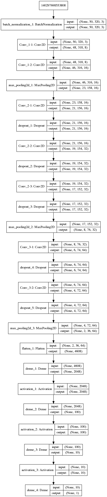
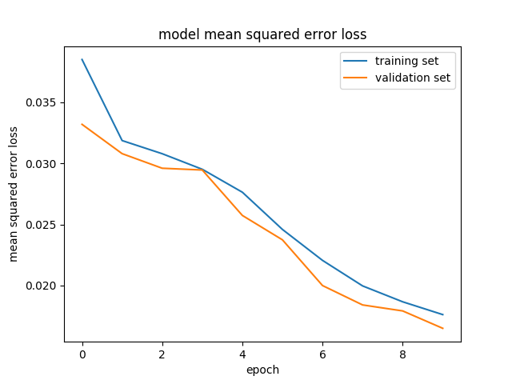

# **Behavioral Cloning** 

### Model Architecture and Training Strategy

### Files

model --> model.py

    * main loop
    * nvidia net
    * vgg net
    * test model
    * model summary (plot, print)

data loading --> data_loader.py
    
    * Preprocess pipe
    * Generator
    * Csv image paths (left/right) to center csv

driving --> drive.py
    
    * Call preprocess pipe
    * Adjust speed
    * Load images from string

results --> results

    * summary images
    * result videos (speed 9/25)

Hints and design choices were taken from the [blog post of Paul Heraty](https://s3-us-west-1.amazonaws.com/udacity-selfdrivingcar/Behavioral+Cloning+Cheatsheet+-+CarND.pdf)
#### 1. An appropriate model architecture has been employed

The model is based on the vgg16 net and contains three blocks with less filter depth. After testing the nvidia model architecture and having problems with the vgg16 keras model this architecture was 
tested with sufficient results

Batch normalization was added for faster training and better generalization. Code with short docu is found in ``model.py, vgg_net() line 34``

_______________________________________________________
Layer (type)                 Output Shape              Param #   
=================================================================
batch_normalization_1 (Batch (None, 50, 320, 3)        12        
_________________________________________________________________
Conv_1-1 (Conv2D)            (None, 48, 318, 8)        224       
_________________________________________________________________
Conv_1-2 (Conv2D)            (None, 46, 316, 16)       1168      
_________________________________________________________________
max_pooling2d_1 (MaxPooling2 (None, 23, 158, 16)       0         
_________________________________________________________________
Conv_2-1 (Conv2D)            (None, 21, 156, 16)       2320      
_________________________________________________________________
dropout_1 (Dropout)          (None, 21, 156, 16)       0         
_________________________________________________________________
Conv_2-2 (Conv2D)            (None, 19, 154, 32)       4640      
_________________________________________________________________
dropout_2 (Dropout)          (None, 19, 154, 32)       0         
_________________________________________________________________
Conv_2-3 (Conv2D)            (None, 17, 152, 32)       9248      
_________________________________________________________________
dropout_3 (Dropout)          (None, 17, 152, 32)       0         
_________________________________________________________________
max_pooling2d_2 (MaxPooling2 (None, 8, 76, 32)         0         
_________________________________________________________________
Conv_3-1 (Conv2D)            (None, 6, 74, 64)         18496     
_________________________________________________________________
dropout_4 (Dropout)          (None, 6, 74, 64)         0         
_________________________________________________________________
Conv_3-2 (Conv2D)            (None, 4, 72, 64)         36928     
_________________________________________________________________
dropout_5 (Dropout)          (None, 4, 72, 64)         0         
_________________________________________________________________
max_pooling2d_3 (MaxPooling2 (None, 2, 36, 64)         0         
_________________________________________________________________
flatten_1 (Flatten)          (None, 4608)              0         
_________________________________________________________________
dense_1 (Dense)              (None, 2048)              9439232   
_________________________________________________________________
activation_1 (Activation)    (None, 2048)              0         
_________________________________________________________________
dense_2 (Dense)              (None, 100)               204900    
_________________________________________________________________
activation_2 (Activation)    (None, 100)               0         
_________________________________________________________________
dense_3 (Dense)              (None, 10)                1010      
_________________________________________________________________
activation_3 (Activation)    (None, 10)                0         
_________________________________________________________________
dense_4 (Dense)              (None, 1)                 11        
=================================================================
Total params: 9,718,189
Trainable params: 9,718,183
Non-trainable params: 6
________________

_________________________________________________
#### 2. Attempts to reduce overfitting in the model

To reduce overfitting the model contains dropout layers within the second and third convolution block. 
```model.py line 34 ff```

#### 3. Model parameter tuning

Parameter from the vgg16 net are copied (kernel size, pooling size) for sufficient results
Image scaling was tested with the vgg16 net, but the image resolution was too small for the standard net

#### 4. Appropriate training data

For generating the training data the hinted approaches were taken:

Using a gamepad instead of the keyboard for smooth steering angle change
Driving the map in different directions
Driving within difficult spots more often (no line mark, grass, dirt road) to give the net more data for this special cases
Add the left/right camera images with a preset offset of +-0.25 to add more data to the training set
Train 10 epochs (after dropout added the loss dose not get worse after epoch 3-5 anymore)

Additionally, a preprocess step for the images was added to the train and drive script. The image is normalized and cropped to show the road only (removed car, sky)
Within the drive script the speed was changed from 9 to different speed to check if the result changes. The car will get the best results with decreased speed in corners, otherwise the car will oscillate within the corners.

The training loss is shown below



The result of a model is tested on 3 images (center/left/right) to see if the steering angle is predicted correctly 

The result video is shown below (Speed : 9)


[Open Video Speed 9](./results/run_vgg_1_lap.mp4)

The result video 2 is shown below (Speed : 25)


[Open Video Speed 25](./results/run_vgg_1_lap_speed.mp4)